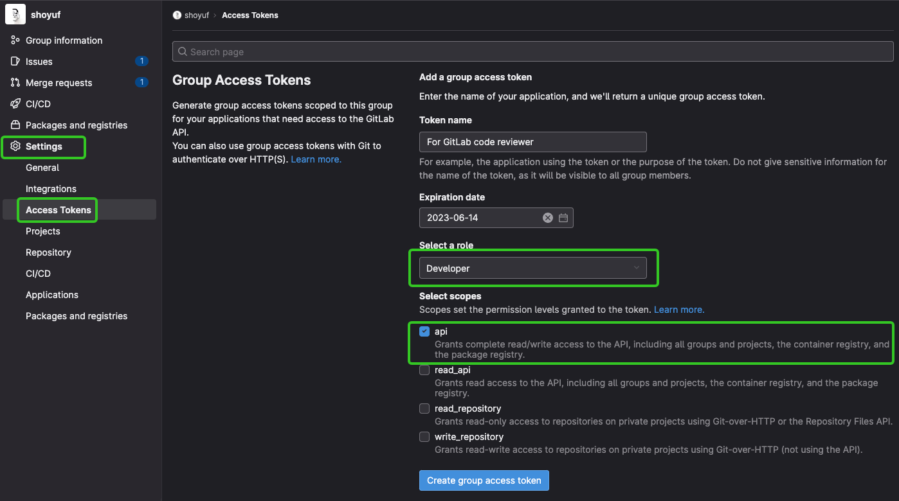
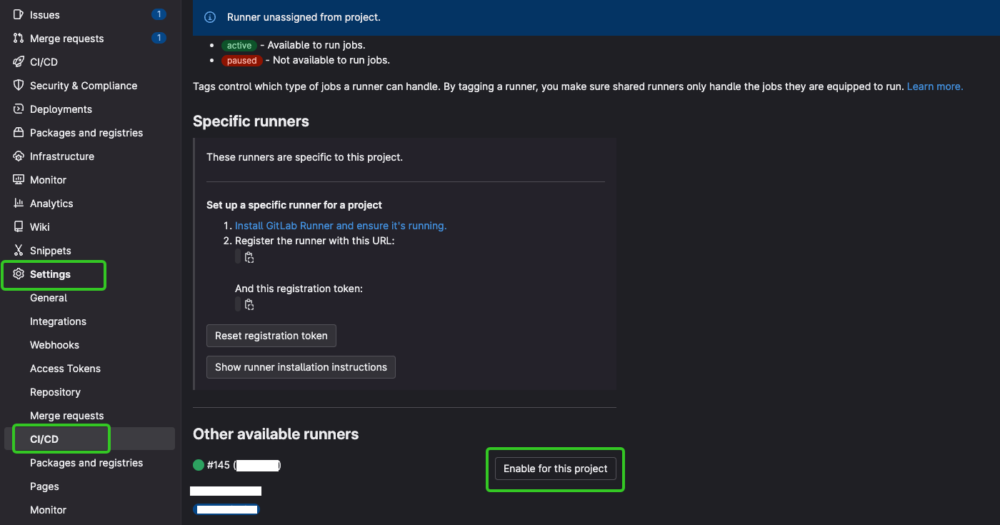
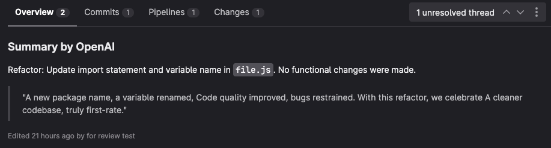
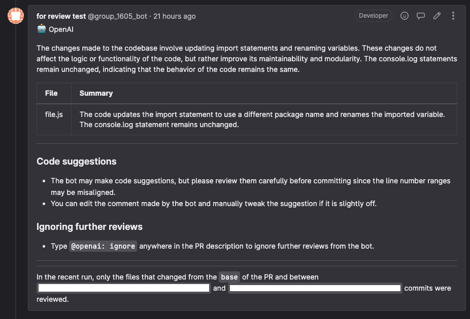
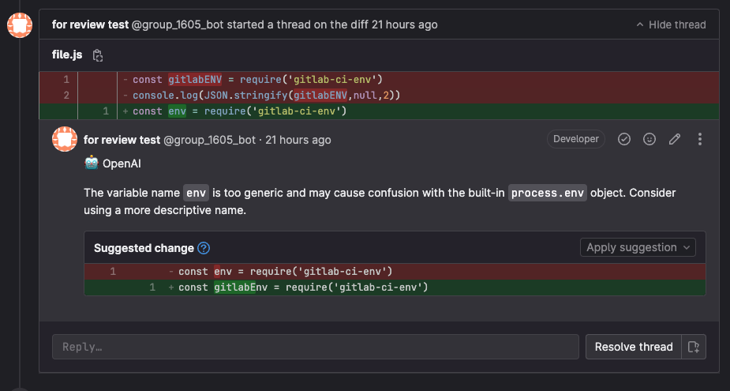

# OpenAI MergeRequest Reviewer Gitlab

## Overview

This [OpenAI ChatGPT-based](https://platform.openai.com/docs/guides/chat) GitLab
Pipeline Application provides a summary, release notes and review of pull
requests. The unique features of this action are:

- **Line-by-line code change suggestions**: This Application reviews the changes
  line by line and provides code change suggestions that can be directly
  committed from the GitLab UI.
- **Continuous, incremental reviews**: Reviews are performed on each commit within a
  pull request, rather than a one-time review on the entire pull request.
- **Cost-effective and reduced noise**: Incremental reviews save on OpenAI costs and
  reduce noise by tracking changed files between commits and the base of the
  pull request.
- **"Light" model for summary**: Designed to be used with a "light" summarization
  model (e.g. `gpt-3.5-turbo`) and a "heavy" review model (e.g. `gpt-4`). For
  best results, use `gpt-4` as the "heavy" model, as thorough code review needs
  strong reasoning abilities.
- **[Not support yet]** Chat with bot: Supports conversation with the bot in the
  context of lines of code or entire files, useful for providing context,
  generating test cases, and reducing code complexity.
- **Smart review skipping**: By default, skips in-depth review for simple changes
  (e.g. typo fixes) and when changes look good for the most part. It can be
  disabled by setting `review_simple_changes` and `review_comment_lgtm` to
  `true`.
- **Customizable prompts**: Tailor the `system_message`, `summarize`, and
  `summarize_release_notes` prompts to focus on specific aspects of the review
  process or even change the review objective.

## Usage

To use the reviewer, you need to follow these two steps:

1. Prepare a key to chat with the OpenAI bot and a key to post a discussion.
1. Set up GitLab Runner and GitLab Runner pipeline.

## Steps

1. Generate `AccessToken` for your Group or Project You can set a Developer Role
   and only provide **`api`** Scopes for it
   

2. Get API Key from [OpenAI](https://platform.openai.com/account/api-keys)

3. Fill `AccessToken` as `GITLAB_PERSONAL_TOKEN` and `OPENAI_API_KEY` in GitLab
   CI/CD Variables Settings for your Group or Project When adding these two
   variables, please ensure the security of the key by checking the "**mask
   variable**" option.
   

4. Register or Enable a GitLab Runner for the pipeline, You can add a new Group
   Runner or use the existing Runner.
   

5. Create a .gitlab-ci.yml file and fill in the content in your repository root
   directory, Then, create merge request and have fun! 🎉

## .gitlab-ci.yml

```yml
default:
  image: node:20

variables:
  GITLAB_HOST:
    value: 'https://www.gitlab.com'
  GITHUB_EVENT_NAME:
    value: 'pull_request'
  debug:
    description: 'Enable debug mode'
    value: 'false'
  max_files:
    description:
      'Max files to summarize and review. Less than or equal to 0 means no
      limit.'
    value: '150'
  review_simple_changes:
    description: 'Review even when the changes are simple'
    value: 'false'
  review_comment_lgtm:
    description: 'Leave comments even if the patch is LGTM'
    value: 'false'
  path_filters:
    description: |
      The path filters, e.g., "src/**.py", "!dist/**", each line will be considered as one pattern.
      See also
      - https://docs.github.com/en/actions/using-workflows/workflow-syntax-for-github-actions#onpushpull_requestpull_request_targetpathspaths-ignore
      - https://github.com/isaacs/minimatch
    value: |
      !.gitlab-ci.yml
      !dist/**
      !**/*.pb.go
      !**/*.lock
      !**/*.yaml
      !**/*.yml
      !**/*.cfg
      !**/*.toml
      !**/*.ini
      !**/*.mod
      !**/*.sum
      !**/*.work
      !**/*.json
      !**/*.mmd
      !**/*.svg
      !**/*.png
      !**/*.dot
      !**/*.md5sum
      !**/*.wasm
      !**/gen/**
      !**/_gen/**
      !**/generated/**
      !**/vendor/**
  disable_review:
    description: 'Only provide the summary and skip the code review.'
    value: 'false'
  disable_release_notes:
    description: 'Disable release notes'
    value: 'false'
  openai_base_url:
    description: 'The url of the openai api interface.'
    value: 'https://api.openai.com/v1'
  openai_light_model:
    description:
      'Model to use for simple tasks like summarizing diff on a file.'
    value: 'gpt-3.5-turbo'
  openai_heavy_model:
    description: 'Model to use for complex tasks such as code reviews.'
    value: 'gpt-3.5-turbo'
  openai_model_temperature:
    description: 'Temperature for GPT model'
    value: '0.0'
  openai_retries:
    description:
      'How many times to retry OpenAI API in case of timeouts or errors?'
    value: '5'
  openai_timeout_ms:
    description: 'Timeout for OpenAI API call in millis'
    value: '360000'
  openai_concurrency_limit:
    description: 'How many concurrent API calls to make to OpenAI servers?'
    value: '4'
  system_message:
    description: 'System message to be sent to OpenAI'
    value: |
      You are `@openai` (aka `github-actions[bot]`), a language model 
      trained by OpenAI. Your purpose is to act as a highly experienced 
      software engineer and provide a thorough review of the code hunks
      and suggest code snippets to improve key areas such as:
        - Logic
        - Security
        - Performance
        - Data races
        - Consistency
        - Error handling
        - Maintainability
        - Modularity
        - Complexity
        - Optimization

      Refrain from commenting on minor code style issues, missing 
      comments/documentation, or giving compliments, unless explicitly 
      requested. Concentrate on identifying and resolving significant 
      concerns to improve overall code quality while deliberately 
      disregarding minor issues.

      Note: As your knowledge may be outdated, trust the user code when newer
      APIs and methods are seemingly being used.
  summarize:
    description: 'The prompt for final summarization response'
    value: |
      Provide your final response in the `markdown` format with 
      the following content:
        - High-level summary (comment on the overall change instead of 
          specific files within 80 words)
        - Table of files and their summaries. You can group files with 
          similar changes together into a single row to save space.

      Avoid additional commentary as this summary will be added as a 
      comment on the GitHub pull request.
  summarize_release_notes:
    description:
      'The prompt for generating release notes in the same chat as summarize
      stage'
    value: |
      Create concise release notes in `markdown` format for this pull request, 
      focusing on its purpose and user story. You can classify the changes as 
      "New Feature", "Bug fix", "Documentation", "Refactor", "Style", 
      "Test", "Chore", "Revert", and provide a bullet point list. For example: 
      "New Feature: An integrations page was added to the UI". Keep your 
      response within 50-100 words. Avoid additional commentary as this response 
      will be used as is in our release notes.

      Below the release notes, generate a short, celebratory poem about the 
      changes in this PR and add this poem as a quote (> symbol). You can 
      use emojis in the poem, where they are relevant.

stages:
  - review

review-job: # This job runs in the review stage, which runs first.
  stage: review
  script:
    - curl -o dist.tar.gz https://github.com/maybeLab/openai-mr-reviewer-gltlab/releases/download/v1.0.0/dist.tar.gz && tar -vxzf dist.tar.gz && node dist/index.cjs
    - echo "review complete."
    - rm -rf ./dist ./dist.tar.gz
  only:
    - merge_requests
```

## Screenshots







## Variables

| Name                     | Description                                                                                    | Default                     |
| ------------------------ | ---------------------------------------------------------------------------------------------- | --------------------------- |
| debug                    | Enable debug mode                                                                              | false                       |
| max_files                | Maximum number of files to summarize and review. Enter less than or equal to 0 for no limit    | 150                         |
| review_simple_changes    | Whether to review even when the changes are simple                                             | false                       |
| review_comment_lgtm      | Whether to leave comments even if the patch is LGTM                                            | false                       |
| path_filters             | Path filters to apply, e.g., "src/.py", "!dist/", each line will be considered as one pattern. | -see in template            |
| disable_review           | Whether to only provide the summary and skip the code review                                   | false                       |
| disable_release_notes    | Whether to disable release notes                                                               | false                       |
| openai_base_url          | The URL of the OpenAI API interface                                                            | `https://api.openai.com/v1` |
| openai_light_model       | The Model to use for simple tasks like summarizing diff on a file                              | gpt-3.5-turbo               |
| openai_heavy_model       | The Model to use for complex tasks such as code reviews                                        | gpt-3.5-turbo               |
| openai_model_temperature | The temperature for the GPT model                                                              | 0                           |
| openai_retries           | Number of times to retry OpenAI API in case of timeouts or errors                              | 5                           |
| openai_timeout_ms        | Timeout for OpenAI API call in milliseconds                                                    | 360000                      |
| openai_concurrency_limit | Maximum number of concurrent API calls to make to OpenAI servers                               | 4                           |
| system_message           | System message to be sent to OpenAI.                                                           | -see in template            |
| summarize                | The prompt for final summarization response.                                                   | -see in template            |
| summarize_release_notes  | The prompt for generating release notes in the same chat as the summarize stage                | -see in template            |
